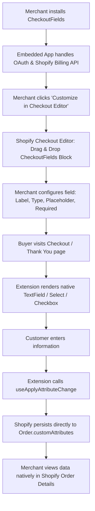

# Implementation Plan: CheckoutFields (All-in-One Custom Fields)

Build a high-intent Shopify Checkout UI Extension that enables merchants to collect custom inputs (gift messages, delivery instructions, VAT/Tax IDs, surveys) at checkout and on post-purchase pages, storing data directly into Shopify Order Attributes without requiring an external database or custom CSS.

## Feasibility & Technical Confirmation

> [!NOTE]
> **Feasibility Confirmed:** Yes, this project is 100% possible using Shopify's official Checkout Extensibility platform.
> - **Zero Database Overhead**: Shopify provides `useApplyAttributeChange` to write customer responses directly to `order.customAttributes`. These automatically appear in Shopify Admin under **Orders > [Order #] > Additional details** (Note Attributes).
> - **Zero Styling Issues**: Shopify strictly prohibits custom CSS; all UI is built using `@shopify/ui-extensions-react/checkout` components (`<BlockStack>`, `<TextField>`, `<Select>`, `<Checkbox>`), ensuring automatic responsiveness and theme font/color matching.
> - **Universal Plan Compatibility**: Shopify Plus stores can render in core checkout steps (`purchase.checkout.block.render`), while non-Plus stores (Basic, Shopify, Advanced) render on the Thank You and Order Status pages (`purchase.thank-you.block.render` and `customer-account.order-status.block.render`).

---

## Architecture & How It Works

---

## User Review Required

> [!IMPORTANT]
> **Shopify App Structure:** To monetize with recurring billing ($9.99 - $14.99/mo) and distribute on the Shopify App Store, a lightweight Shopify App wrapper (Node/Remix) is required alongside the Checkout UI Extension.
> - The app backend handles OAuth, App Billing (Shopify Billing API), and presents an onboarding dashboard with a 1-click deep link into the merchant's Checkout Editor.
> - The Checkout UI Extension itself runs natively in the buyer's browser and communicates directly with Shopify's checkout engine.

---

## Open Questions

1. **Scaffold Preference:** Would you like to scaffold the full app wrapper (with Shopify App CLI + Node/Remix template including the Checkout UI extension for billing & store listing), or start with just the standalone Checkout UI Extension code and configuration files first?
2. **Pricing Structure:** Should we configure the app billing tier as:
   - Option A: Flat $12.99/mo with a 7-day free trial.
   - Option B: Tiered ($9.99/mo for Thank You / Non-Plus, $14.99/mo for Plus Checkout steps).

---

## Proposed Changes

### 1. Project Scaffolding
Initialize the project using Shopify CLI:
- Run `npm init @shopify/app@latest` (or `npx @shopify/cli app generate extension`)
- Target: Checkout UI Extension (`checkout-ui`) with React

---

### 2. Extension Configuration (`shopify.extension.toml`)
Configure multi-target rendering and merchant settings schema.

#### [NEW] [shopify.extension.toml](file:///Volumes/SSD/Coding/website/Shopify%20App/CheckoutFields/extensions/checkout-fields/shopify.extension.toml)
- Declare extension targets:
  - `purchase.checkout.block.render` (Checkout steps: Information, Shipping, Payment)
  - `purchase.thank-you.block.render` (Thank You page)
  - `customer-account.order-status.block.render` (Order Status page)
- Define `[extensions.settings.fields]` schema:
  - `field_type`: Single-select (`text`, `multiline`, `select`, `checkbox`, `number`)
  - `field_title`: Text input (e.g. "Gift Message" or "Delivery Instructions")
  - `field_placeholder`: Text input (e.g. "Enter your message here...")
  - `field_required`: Boolean toggle
  - `attribute_key`: Text input (defaults to `custom_field` or sanitized title)
  - `select_options`: Multiline/comma-separated text for dropdown options
  - `field_help_text`: Optional subtext/help text

---

### 3. Extension Core Component (`CheckoutFields.jsx`)

#### [NEW] [CheckoutFields.jsx](file:///Volumes/SSD/Coding/website/Shopify%20App/CheckoutFields/extensions/checkout-fields/src/Checkout.jsx)
- Utilize hooks from `@shopify/ui-extensions-react/checkout`:
  - `useSettings()` to read merchant settings dynamically.
  - `useApplyAttributeChange()` to write value changes to `order.customAttributes`.
  - `useInstructions()` to determine if attributes are writable.
  - `useBuyerJourneyIntercept()` (optional) for required field validation before checkout submission.
- Dynamically render based on `field_type`:
  - `<TextField>` (single-line or multiline)
  - `<Select>` (with dynamic `<option>` items from merchant configuration)
  - `<Checkbox>` (for terms agreement, gift wrap, etc.)
  - Wrapped in `<BlockStack>` with clean spacing.

---

### 4. Admin Onboarding & Billing Dashboard (App Layer)
- Embedded Polaris React dashboard:
  - Setup instructions with visual guide on how to add the block in the Checkout Editor.
  - Quick presets: "Gift Message", "Delivery Instructions", "How did you hear about us?", "VAT / Tax ID".
  - One-click button: "Customize in Checkout Editor" (`https://admin.shopify.com/store/{shop}/settings/checkout/editor`).
  - Shopify Billing API integration for plan subscription.

---

## Verification Plan

### Automated Tests
- Type checking / linting: `npm run lint`
- Build check: `npm run build` to ensure UI extension bundles cleanly without external CSS dependencies.

### Manual Verification
- Run `npx @shopify/cli app dev` to link with a Shopify Partner development store.
- In the development store Checkout Editor:
  1. Add the "CheckoutFields" block to the Shipping / Payment step.
  2. Test changing settings (Title, Field Type, Placeholder, Required toggle).
  3. Enter test data in checkout and complete a test purchase.
  4. Verify the entered value appears inside Shopify Admin > Orders > Order Details > Note Attributes.
  5. Repeat test on the Thank You page (`purchase.thank-you.block.render`).
